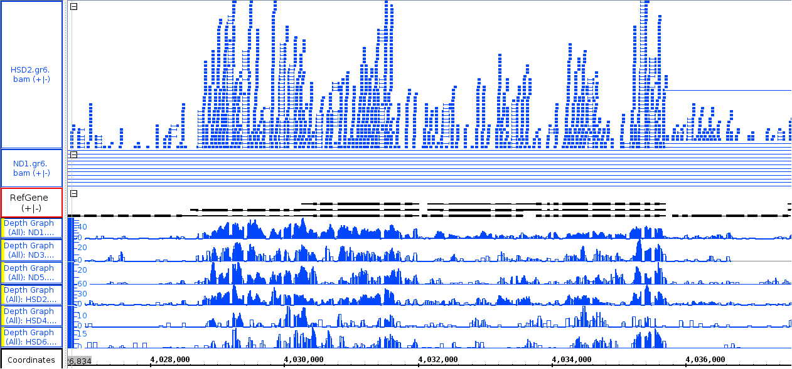

# Notes: joint exploratory project: RNA-seq pipeline exploration and establishment

## Installation
Downloaded zipped source from website and `make` into `~/packages`.  
Multiple errors were displayed on screen while making, but the test `-v` and `-h` returned normal results.

## Reference retrieval and indexing
MapSplice2 calls for chromosome separated `.fa` files as reference. To get the proper reference:
 + download:  ftp://flybase.net/genomes/Drosophila_melanogaster/current/fasta/dmel-all-chromosome-r6.13.fasta.gz
 + unzip
 + split into chromosome specific files: `nemo13@diaorch:~/database/genomes/Dm_split_chrom/split_by_chrom.py`

## Alignments: Run attempts

### Attempt 1
Failure reason: white spaces in header
Solution: strip all white spaces from the headers
Script: `nemo13@diaorch:~/database/genomes/Dm_split_strip_chrom/strip_split_by_chrom.py`

### Attempt 2
Failure reason: wrong header names after striping the white spaces
Example:
```
Error: Bowtie Index not consistent with Reference Sequence
'Xtype=golden_path_region;loc=X:1..23542271;ID=X;dbxref=GB:AE014298,GB:AE014298,REFSEQ:NC_004354;MD5=f7228bbf9f8fa0af457bc2fb7e396e4d;length=23542271;release=r6.13;species=Dmel;' does not exist in Reference Sequence
```
Solution: keep only chromosome names as headers

### Attempt 3
Attempt 2 was up for running to the step of mapping, for about 20 mins. After talking with Peter, it was considered a better practice to include all "chromosome" files for mapping. Thus Attempt 2 was terminated. I was also reminded by Peter about ERCC "spike-in"s need to be put into the reference.  
Thus the new attempt is:
 + trim the headers to "chromosome" names only, for both the reference sequence and ERCC sequences. ERCC sequences are found at: `diaorch@serenity:/home/petefred/plf_work/fly/seq_dbs/ercc92/ERCC92.fa`.  
 In the reference sequence case, "chromosome" names would be the IDs in the first field of the original header, and in ERCCs would be the headers themselves
 + pool reference sequences and ERCC sequences as chromosome files together
 + index all chromosome files

Failure reason: MapSplice2 quits unexpectedly after step "building Bowtie indexes". My suspects is that it could not handle 1817 chromosome files.
Solution: After emailing Peter, we decided to limit the analysis to classic chromosomes, i.e. 2, 3, 4, X and Y. Adding ERCC sequences, each of which treated as a separate chromosome.  

### Attempt 4
Failure reason: errors made when preprocessing Fasta files to split reference sequences to chromosome specific files and ERCC files into "chromosome files". The previous script splits out the last entries as header-only and sequence-empty file, which clogs MapSplice2.  
Solution:
 + rewrite splitting script to fix the bug
 + reformat ERCC output files to 80 character per line instead of 60

### Attempt 5
Up for running for all 6 samples, using a caller shell script `align.[1-6].sh`. Data stored at `/data2/diaorch/ranSeqComparison/`.

## Sam to Bam conversion, sorting
Use `samtools view` to convert SAM files to BAM files, then use `samtools sort` to sort BAM files in coordinates. Steps written in scripts.

## QoRTs quality control

### Attemp 1: non-dedupe, view and sort
Failure reason: QoRTs reports a fatal error for a read saying mapped mates should have corresponding names.
Solution: add filter of "half-mapped" reads (reads that one of the paired is mapped but the other one is not), sort and attempt again.

### Attemp 2: non-dedupe, view, sort, view
Failure reason: no usable reads.  
The log reminds user that running QoRTs on alignment results that are not from "standard" aligners (RNA-STAR, TopHat) etc may cause error. In this case, no usable reads are founds, as all reads are dropped for non-unique alignment. This also cause an error predicted by the program when trying to write the results to file.  

## IGB screen shot to show spliced alignments


## HTSeq counting
Use alignment bam files, sorted by name, filtered to keep proper pairs, as input.  

## DESeq2
Script: `~/projects/lab/rnaSeqComparison/de.R`, including log2-fold-change calculation and correlations.
