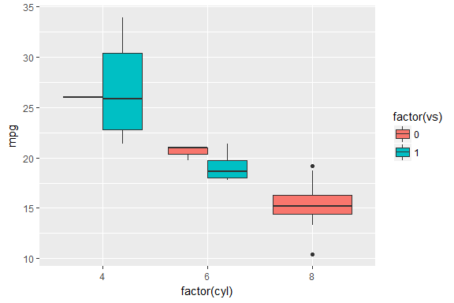
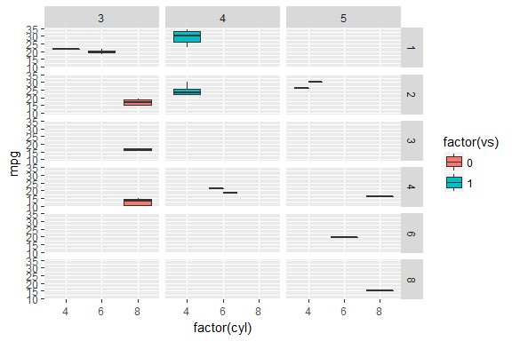

R markdown notebook taking example
================
nemo13\_diaorch
March 31, 2017

Introduction
------------

This is a R Markdown example demonstrating using GitHub to render R Markdown as a method of keeping lab notebooks or record of exploratory data. This example of plotting is adapted from [Index of `ggplot2` page of boxplot](http://docs.ggplot2.org/0.9.3.1/geom_boxplot.html) and [Index of `ggplot2` facet grid](http://docs.ggplot2.org/0.9.3.1/facet_grid.html).

R Markdown
----------

This is an R Markdown document. Markdown is a simple formatting syntax for authoring HTML, PDF, and MS Word documents. For more details on using R Markdown see <http://rmarkdown.rstudio.com>.

Example of boxplot plotting
---------------------------

``` r
library(ggplot2)
p <- ggplot(mtcars, aes(factor(cyl), mpg))
p + geom_boxplot(aes(fill = factor(vs)))
```



Inserted here is an example of $\\LaTeX$ rendering equation. The next figure is plotting `mtcars` data set with facet of:

(*carb* ∼ *gear*)

``` r
p <- ggplot(mtcars, aes(factor(cyl), mpg))
p + geom_boxplot(aes(fill = factor(vs))) + facet_grid(carb ~ gear)
```


